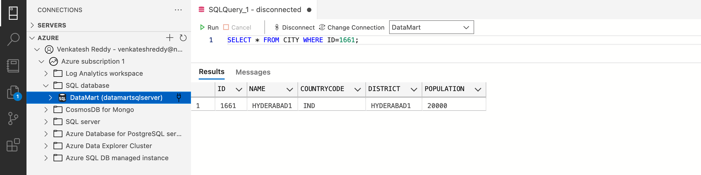
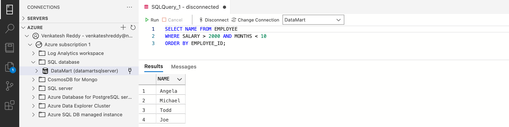
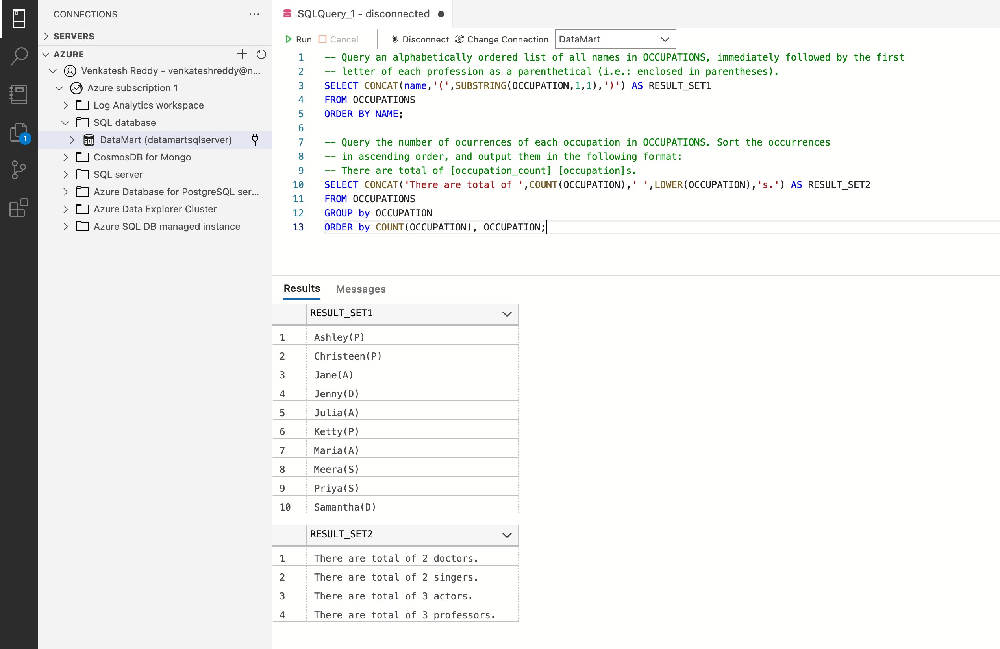
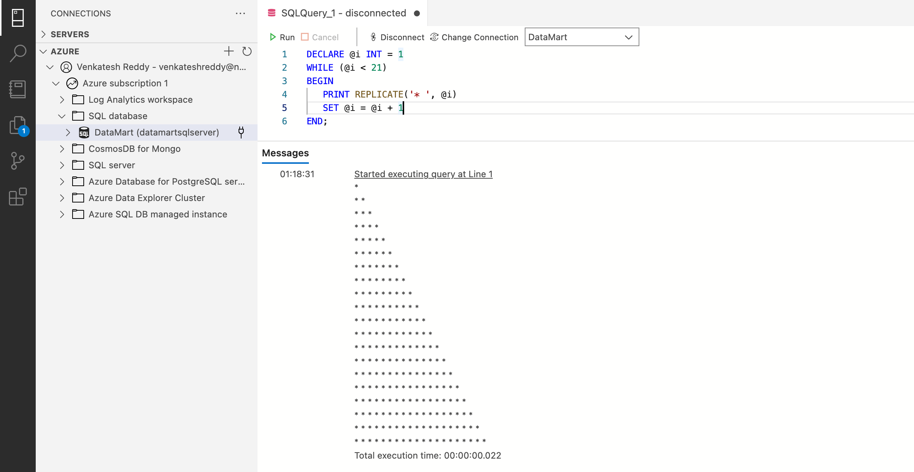
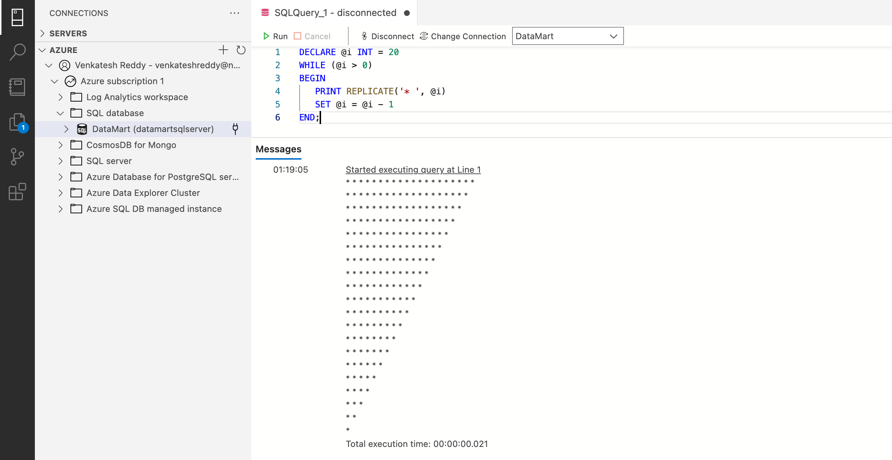
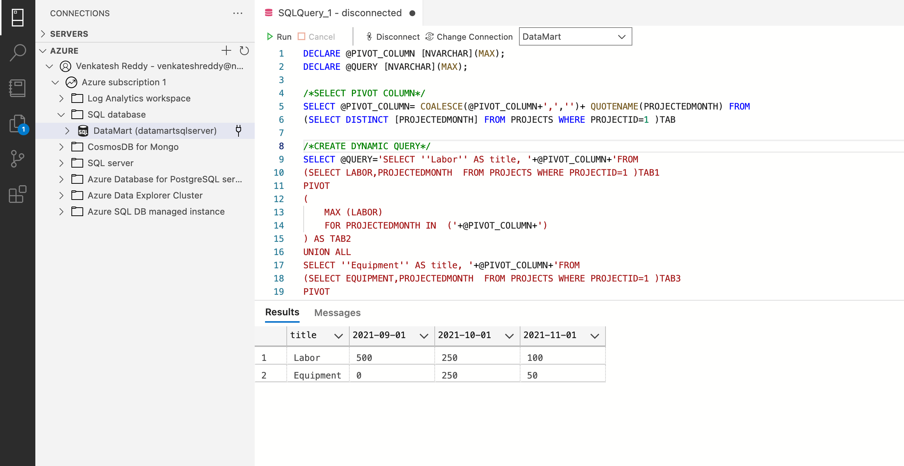

## 1.
Query all columns for a city in CITY with the ID 1661.

The CITY table is described as follows:

| Field        | Type         |
|--------------|--------------|
| ID           | NUMBER       |
| NAME         | VARCHAR2(17) |
| COUNTRY CODE | VARCHAR2(3)  |
| DISTRICT     | VARCHAR2(20) |
| POPULATION   | NUMBER       |

**Solution**
```sql
SELECT * FROM CITY WHERE ID=1661;
```


## 2.

Write a query that prints a list of employee names (i.e.: the name attribute) for employees
in Employee having a salary greater than $2000 per month who have been employees for less than
10 months. Sort your result by ascending employee_id.

The Employee table containing employee data for a company is described as follows:

| Column      | Type    |
|-------------|---------|
| employee_id | Integer |
| name        | String  |
| months      | Integer |
| salary      | Integer |


where employee_id is an employee's ID number, name is their name, months is the total number of
months they've been working for the company, and salary is their monthly salary.

**Solution**
```sql
SELECT NAME FROM EMPLOYEE
WHERE SALARY > 2000 AND MONTHS < 10
ORDER BY EMPLOYEE_ID;
```


## 3.

Generate the following two result sets:
Query an alphabetically ordered list of all names in OCCUPATIONS, immediately followed by the first
letter of each profession as a parenthetical (i.e.: enclosed in parentheses). For
example: AnActorName(A), ADoctorName(D), AProfessorName(P), and ASingerName(S).
Query the number of occurrences of each occupation in OCCUPATIONS. Sort the occurrences
in ascending order, and output them in the following format:

There are total of [occupation_count] [occupation]s.

where [occupation_count] is the number of occurrences of an occupation
in OCCUPATIONS and [occupation] is the lowercase occupation name. If more than
one Occupation has the same [occupation_count], they should be ordered alphabetically.
Note: There will be at least two entries in the table for each type of occupation.

The OCCUPATIONS table is described as follows:

| Column     | Type   |
|------------|--------|
| Name       | String |
| Occupation | String |


Occupation will only contain one of the following values: Doctor, Professor, Singer or Actor.


Sample Output

Ashely(P)

Christeen(P)

Jane(A)

Jenny(D)

Julia(A)

Ketty(P)

Maria(A)

Meera(S)

Priya(S)

Samantha(D)

There are a total of 2 doctors.

There are a total of 2 singers.

There are a total of 3 actors.

There are a total of 3 professors.

Explanation

The results of the first query are formatted to the problem description&#39;s specifications.
The results of the second query are ascendingly ordered first by number of names corresponding to
each profession (2&lt;= 2&lt;= 3&lt;=3), and then alphabetically by profession doctor&lt;= singer and actor &lt;=
professor)

**Solution**
```sql
SELECT CONCAT(name,'(',SUBSTRING(OCCUPATION,1,1),')') AS RESULT_SET1
FROM OCCUPATIONS
ORDER BY NAME;
```

```sql
SELECT CONCAT('There are total of ',COUNT(OCCUPATION),' ',LOWER(OCCUPATION),'s.') AS RESULT_SET2
FROM OCCUPATIONS
GROUP by OCCUPATION
ORDER by COUNT(OCCUPATION), OCCUPATION;
```


## 4.

P(R) represents a pattern drawn by Julia in R rows. 

The following pattern represents P(5):
```
*
* *
* * *
* * * *
* * * * *
```
Write a query to print the pattern P(20).

**Solution**
```sql
DECLARE @i INT = 1
WHILE (@i < 21)
BEGIN
   PRINT REPLICATE('* ', @i)
   SET @i = @i + 1
END;
```


## 5.

P(R) represents a pattern drawn by Julia in R rows. 

The following pattern represents P(5):
```
* * * * *
* * * *
* * *
* *
*
```
Write a query to print the pattern P(20).

**Solution**
```sql
DECLARE @i INT = 20
WHILE (@i > 0)
BEGIN
PRINT REPLICATE('* ', @i)
SET @i = @i - 1
END;
```


## 6.

Write a (dynamic) PIVOT to obtain the below result:
Use the DML and DDL statements below.

CREATE TABLE PROJECTS
(
PROJECTID INT
,PROJECTEDMONTH DATE
,LABOR INT
,EQUIPMENT INT
);

INSERT INTO PROJECTS VALUES (1,'2021-09-01', 500, 0)
, (1,'2021-10-01', 250,250)
, (1,'2021-11-01', 100,50)
, (2,'2021-11-01', 100,50)
, (2,'2021-12-01', 100,50);

**Solution**
```sql
DECLARE @PIVOT_COLUMN [NVARCHAR](MAX);
DECLARE @QUERY [NVARCHAR](MAX);

/*SELECT PIVOT COLUMN*/
SELECT @PIVOT_COLUMN= COALESCE(@PIVOT_COLUMN+',','')+ QUOTENAME(PROJECTEDMONTH) FROM
(SELECT DISTINCT [PROJECTEDMONTH] FROM PROJECTS WHERE PROJECTID=1 )TAB

/*CREATE DYNAMIC QUERY*/
SELECT @QUERY='SELECT ''Labor'' AS title, '+@PIVOT_COLUMN+'FROM
(SELECT LABOR,PROJECTEDMONTH  FROM PROJECTS WHERE PROJECTID=1 )TAB1
PIVOT
(
MAX (LABOR)
FOR PROJECTEDMONTH IN  ('+@PIVOT_COLUMN+')
) AS TAB2
UNION ALL
SELECT ''Equipment'' AS title, '+@PIVOT_COLUMN+'FROM
(SELECT EQUIPMENT,PROJECTEDMONTH  FROM PROJECTS WHERE PROJECTID=1 )TAB3
PIVOT
(
MAX (EQUIPMENT)
FOR PROJECTEDMONTH IN  ('+@PIVOT_COLUMN+')
) AS TAB4'

/*EXECUTE QUERY*/
EXEC  SP_EXECUTESQL  @QUERY
```



