## Step 1: Data Ingestion

Source link: [Hollywood Theatrical Market Synopsis 1995 to 2021 | Kaggle](https://www.kaggle.com/datasets/johnharshith/hollywood-theatrical-market-synopsis-1995-to-2021?select=HighestGrossers.csv)

Dataset: HighestGrossers.csv

Hint: You can use HTTP linked service for this but not limited.

Prefer to use Azure Key vault for storing and accessing sensitive data such as Database credentials.

Database Name: DataMart

Schema: temp_stage

Table: landing_MovieDetails

**Solution**

1) Upload the CSV file to Azure
   1. Create Storage Account
   2. Create blob container
   3. Add an input folder and HighestGrossers.csv file for the blob container
   
   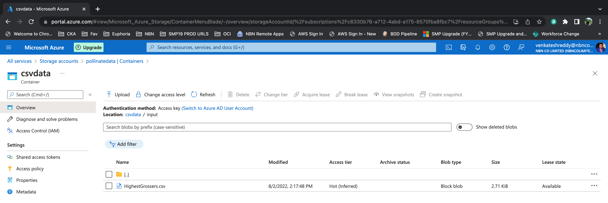

2) Create Azure SQL Database
   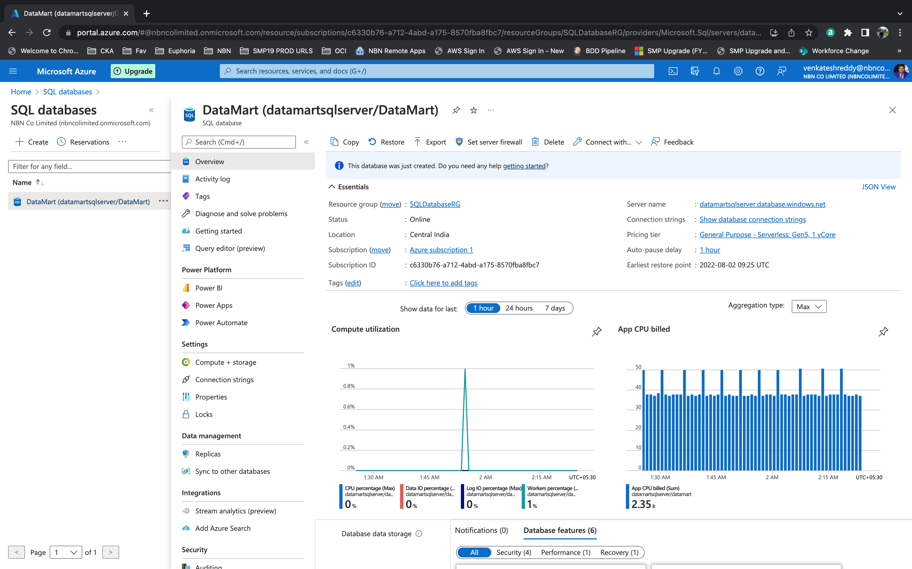

3) Create Secret i.e SQL Password in Azure Key Vault
   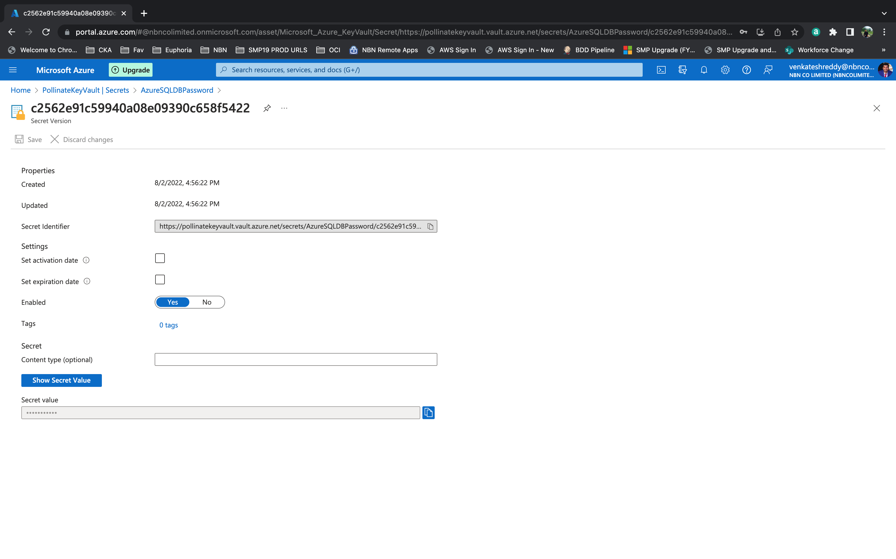

4) Create Azure Data Factory 
   1) Refer https://docs.microsoft.com/en-us/azure/data-factory/quickstart-create-data-factory-portal to create a data factory by using the Azure portal and Azure Data Factory Studio
   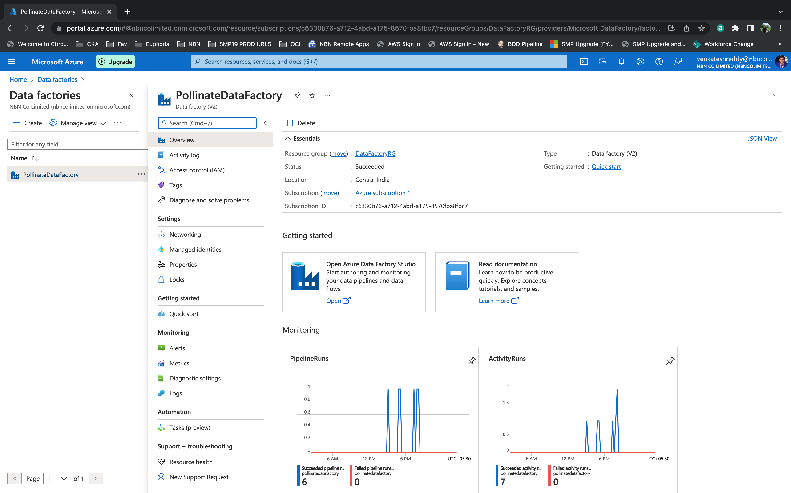
   

5) Create Linked Services
   1) AzureKeyVaultLinkedService - To connect to Key Vault
      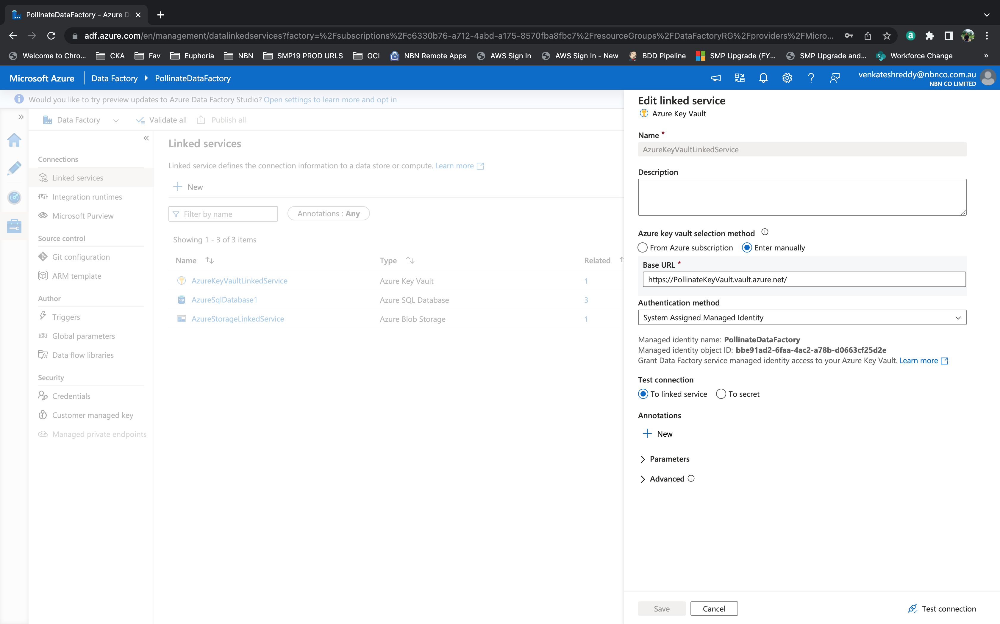
   2) AzureSqlDatabase1 - To connect to SQL Database
      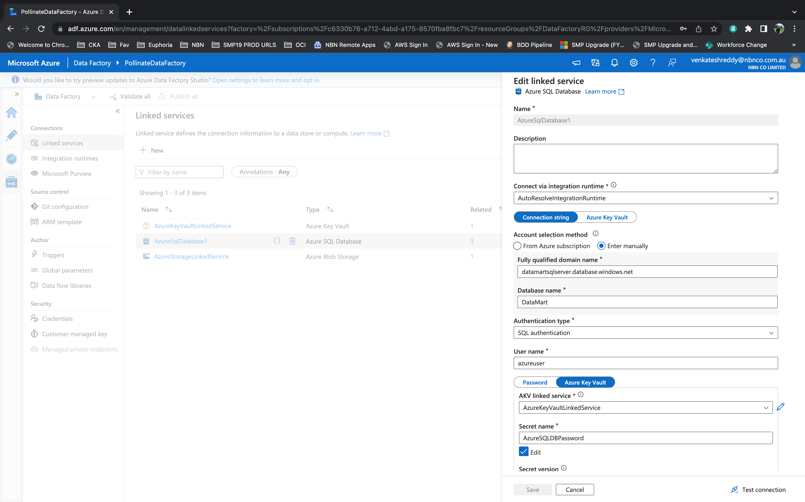
   3) AzureStorageLinkedService - To connect to Storage Account
      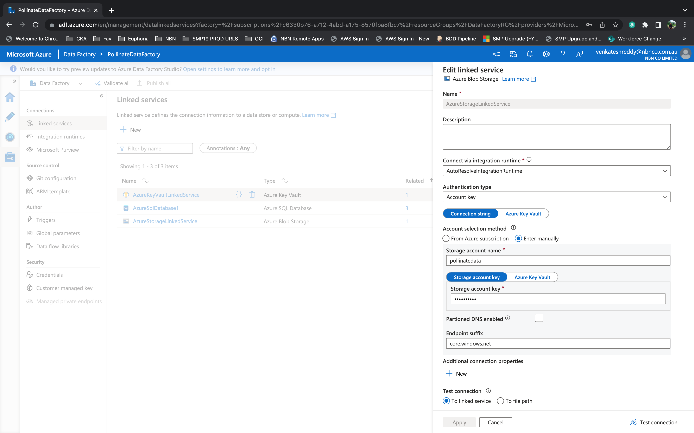
 
  
6) Create Datasets
   1) SourceDataset - HighestGrossers.csv file present in Storage Account
      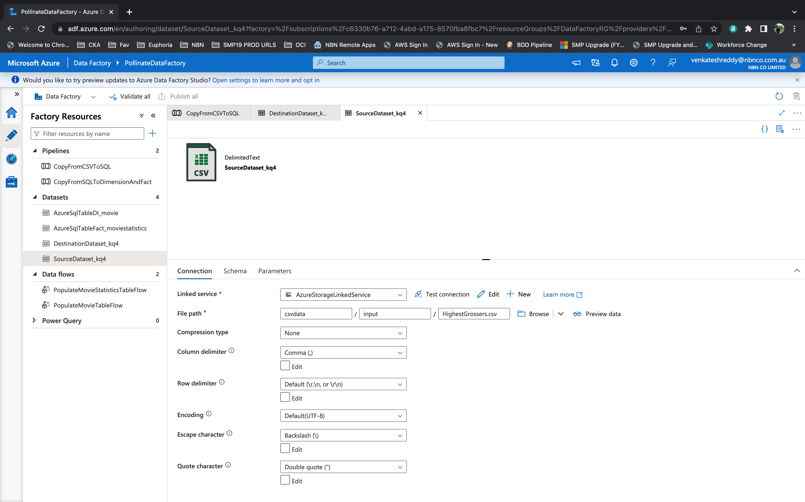
   2) DestinationDataset - temp_stage.landing_MovieDetails Table in DB
      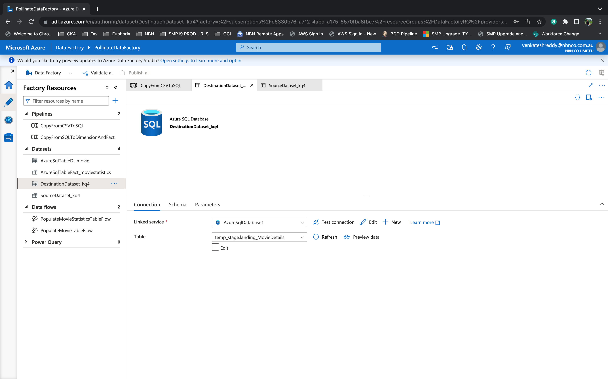
   

7) Use the Copy Data tool to create a pipeline
   1) Refer https://docs.microsoft.com/en-us/azure/data-factory/tutorial-copy-data-tool
   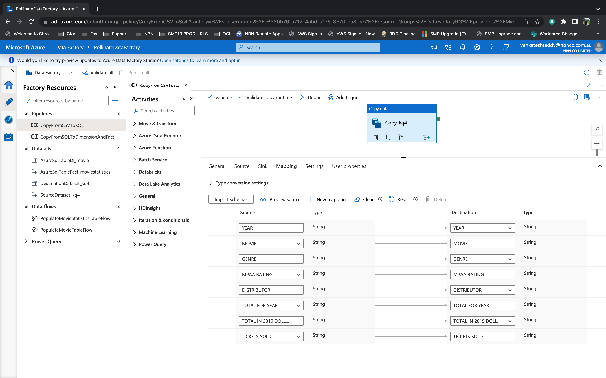

4) Trigger the pipeline
   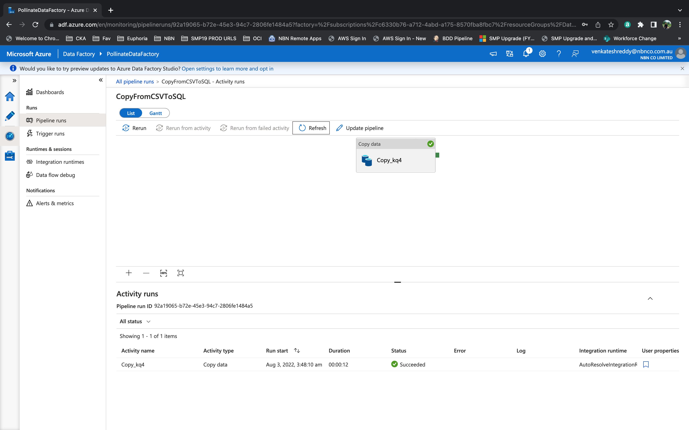   

8) Verify that the data is inserted into the table in your SQL Database.
   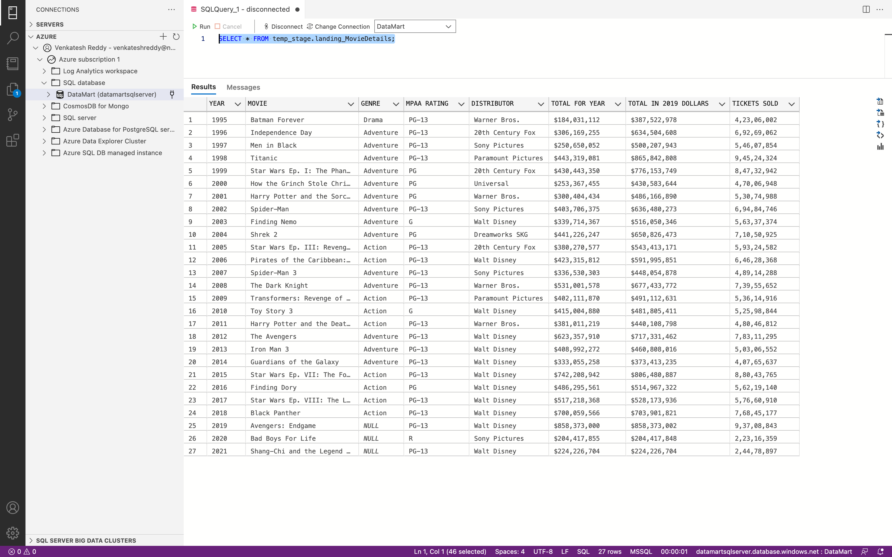