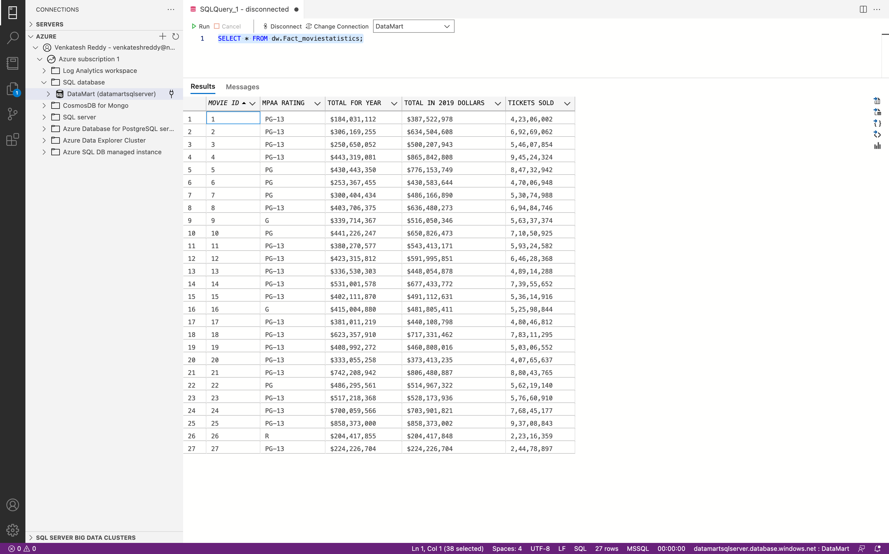

## Step 2: Modelling

Free to decide the columns for the tables mentioned below.
Once data is ingested to the Temp Table above, model the data in to the below mentioned fact and
dimension table. Use a simple modelling and insert the data into the below tables.
Note: Free to use any functionality in Azure Data factory, Expectation is a simple ingestion of CSV
into temporary table in Azure SQL database.
Schema: dw
Table: Create two tables,
Fact: Fact_moviestatistics
Dimension: DI_movie

**Solution**

We will model the data into below 2 tables where additional column MOVIE ID of DI_movie Table acts as a FOREIGN KEY VALUE in Fact_moviestatistics Table

DI_movie [ MOVIE ID, MOVIE, YEAR, GENRE, DISTRIBUTOR ], where we will generate some unique value for MOVIE ID in Data Flow

Fact_moviestatistics [ MOVIE ID, MPAA RATING, TOTAL FOR YEAR, TOTAL IN 2019 DOLLARS, TICKETS SOLD ]

1) Create Datasets
   1) AzureSqlTableDI_movie - dw.DI_movie Table in DB
      
   2) AzureSqlTableFact_moviestatistics - dw.Fact_moviestatistics Table in DB
      
   
2) Create Data flows
   1) PopulateMovieTableFlow, Generate MOVIE ID value
      
   2) PopulateMovieStatisticsTableFlow, Lookup MOVIE ID from dw.DI_movie to act as FOREIGN KEY VALUE
      
   
3) Create a pipeline CopyFromSQLToDimensionAndFact which invokes above data flows
   

4) Trigger the pipeline
   

6) Verify that the data is inserted into the table in your SQL Database.
   
   

