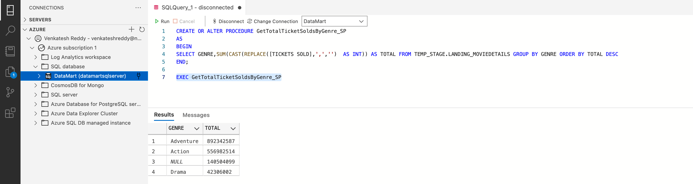
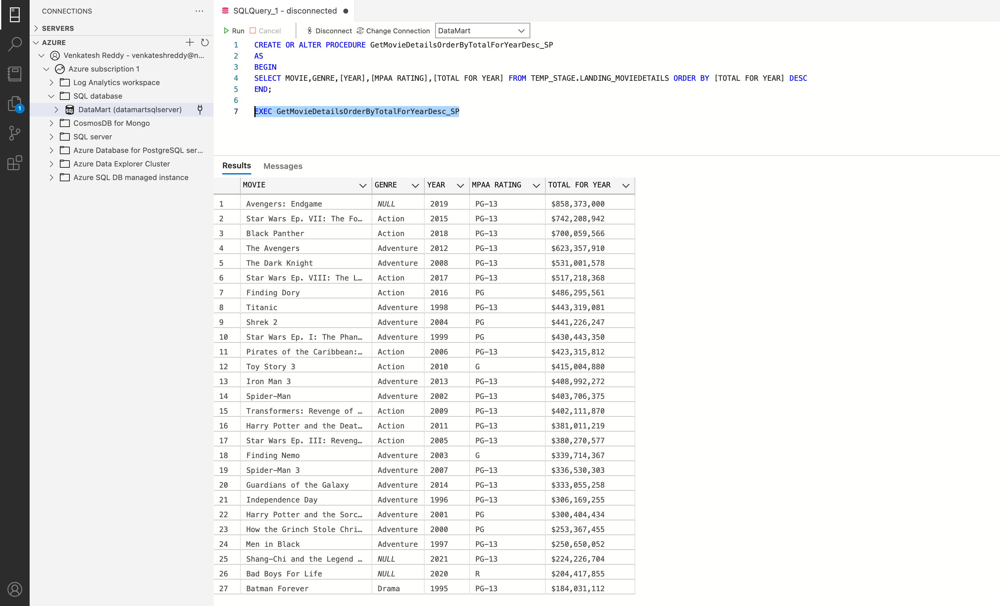

## 1.

Create a stored procedure to get the Total tickets sold (Highest – lowest) by Genre

**Solution**
```sql
CREATE OR ALTER PROCEDURE GetTotalTicketSoldsByGenre_SP
AS
BEGIN
SELECT GENRE,SUM(CAST(REPLACE([TICKETS SOLD],',','')  AS INT)) AS TOTAL FROM TEMP_STAGE.LANDING_MOVIEDETAILS GROUP BY GENRE ORDER BY TOTAL DESC
END;

EXEC GetTotalTicketSoldsByGenre_SP
```


## 2.

Create a stored procedure to generate a report to get the movie name, Genre, Year, Rating, Total
for Year.

Result of the stored procedure should be in descending order of the column [Total_for_year]

**Solution**
```sql
CREATE OR ALTER PROCEDURE GetMovieDetailsOrderByTotalForYearDesc_SP
AS
BEGIN
SELECT MOVIE,GENRE,[YEAR],[MPAA RATING],[TOTAL FOR YEAR] FROM TEMP_STAGE.LANDING_MOVIEDETAILS ORDER BY [TOTAL FOR YEAR] DESC
END;

EXEC GetMovieDetailsOrderByTotalForYearDesc_SP
```

